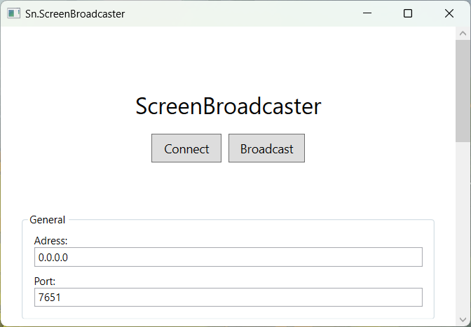
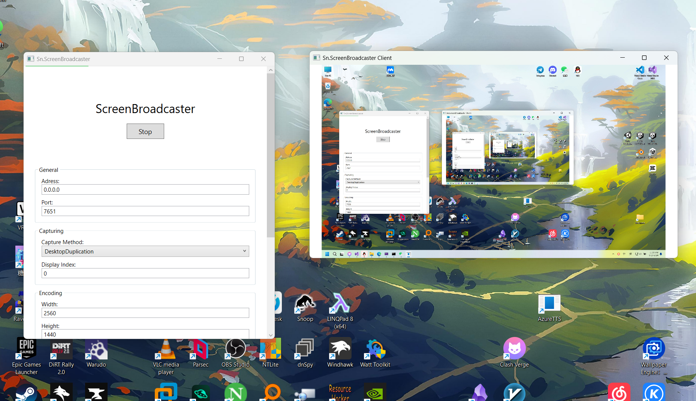

# Sn.ScreenBroadcaster

A screen sharing app based on [FFmpeg](https://ffmpeg.org/).

 

## Usage

Broadcast your screen:

1. Enter the address and port to listen on.
2. Click the 'Broadcast' button.

View other people's screen:

1. Enter the address and port to connect to.
2. Click the 'Connect' button.

 

## Features

- User selectable capture method, supports Desktop Duplication and BitBlt.
- You can set the width and height of the screen share (scaled to the specified size during encoding).
- Frame rate limit, bit rate, encoding format (supports H264, H265), pixel format (supports YUV420, YUV422 and YUV444).
- When the decoder is overloaded, it is possible to drop some frames to relieve the stress.

 

## Snapshots

App:

Broadcasting

